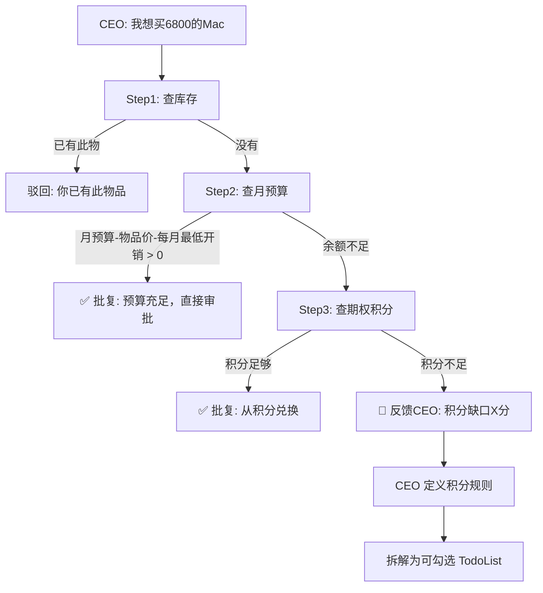
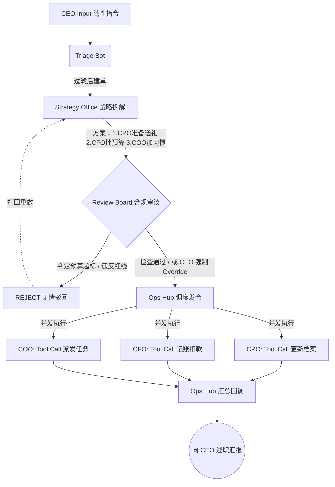

<h1 align="center">🏢 Mycrop · 个人成长数字公司</h1>

<p align="center">
  <strong>我把自己的生活管理，改造成了一个有 14 位 AI 高管的虚拟公司。<br>用现代企业治理架构，对抗个人的拖延与混乱。</strong>
</p>

<p align="center">
  <sub> 沉浸可视化 × Synergy 深度协同 × 分权治理机制。<br>14 个 Agent 基于新一代协同链条 (Finance/Ops/Health) 深度耦合。<br>买个 MacBook 都得过资金锁定、任务转化、健康审计三重关卡。</sub>
</p>

<p align="center">
  <a href="#-为什么要做-mycrop">🤔 为什么</a> ·
  <a href="#️-架构14-个智能体角色">🏛️ 架构</a> ·
  <a href="#-各部门详细运转流程与业务协同">💼 部门协同</a> ·
  <a href="#-核心亮点">✨ 亮点</a> ·
  <a href="#-快速体验">🚀 快速体验</a>
</p>

<p align="center">
  
  
  
  
  
  
  
</p>

---

<!-- GIF 占位 -->
<p align="center">
  <i>👉 在这里放置展示 2.5D 公司大楼动效与早会气泡的 GIF (1) 👈</i>
</p>
<p align="center">
  <i>👉 在这里放置在审批中心提交任务并被 AI 高管驳回的实机录屏 GIF (2) 👈</i>
</p>

---

## 🌟 核心特性速览

- [x] 🧠 **14 位 AI 高管协同流 (v2.4)** — 跨部门深度协同（Finance 锁定资金 -> Ops 自动转化任务 -> Health 动态审计及一票否决权）。
- [x] 👾 **职能下沉式虚拟办公楼** — 移除全局 HUD，将融资进度、合规政策、健康预警直接集成至对应的部门办公室。
- [x] 🔒 **积分锁定机制** — 战略资产融资期间，积分专款专用，通过任务积累达成 100% 前禁止挪用。
- [x] 🎯 **自然语言任务转化** — 直接下达愿景，Operations Agent 自动将其解析为带 Cron 的结构化自律任务。
- [x] ⚖️ **健康一票否决 (Veto Power)** — 首席健康官 Dr.Chen 监控疲劳值，当健康受损时，强制休眠指令覆盖所有积分任务。

---

## 📚 架构哲学与底层思想 (Design Philosophy)

Mycrop 并非简单的 API 堆砌，它的底层逻辑深受以下 5 大现代管理与系统科学著作的启发：

1. **《原则》(Principles) — 机器模型与极端透明**
   * **系统映射**：将个人生活视为一台“机器”。不仅体现在 `Strategy -> Review -> Ops Hub` 的多阶纠错机制，更体现在**思维图谱全景展示**中——系统对每一次“驳回”都保持极端透明，你可以随时查阅 14 位 AI 高管的底层思考逻辑链。
2. **《系统之美》(Thinking in Systems) — 捍卫系统反馈回路**
   * **系统映射**：对抗拖延不是靠意志力，而是靠反馈回路。Phase 7 引入的 `Chief Audit Officer (首席审计官)` 提供硬核的**夜间负反馈清算**；而 `COO` 与 `CFO` 联动的积分抽成系统，则构建了强烈的正向激励回路。
3. **《卓有成效的管理者》(The Effective Executive) — 严苛的职能边界**
   * **系统映射**：明确定义 14 位高管的权限矩阵。“规划者不可审核，审核者不可执行”。执行层的 `CAO (行政总监)` 或 `CGO (财务总监)` 绝对没有任何越过 `Review Board (审核委员会)` 私自操作数据的权利，彻底杜绝多智能体系统的幻觉发散与推诿冗余。
4. **《算法人生》(Algorithms to Live By) — 用硬核算法指导生活**
   * **系统映射**：体现在我们的 **四阶段调度容错引擎 (Robust Scheduler)** 中。对于 Agent 执行过程出现的异常，采用标准计算机思维进行 `Auto-Retry`、`Escalate` 到最后的事务级 `Rollback` 缓存清理，保证生活这台机器不会轻易宕机。
5. **《原子习惯》(Atomic Habits) — 极细颗粒度的执行力**
   * **系统映射**：剥离宏大叙事，聚焦基层执行。专门的 `COO (首席运营官)` 负责精细化的 Kanban 派发和**习惯动作（SOP）与奖赏值（Points）的深度锚定**，保证 1% 的习惯复利在底层得到执行。

---

## 🤔 为什么要做 Mycrop？

因为受够了**四分五裂**的生活管理方式：
- **To-Do 类**：只管打勾，不管预算，更不管你的死活（身体状态）。
- **记账类**：只管记录，没有约束。你花了钱，它只会叹气，不会拦截。
- **习惯打卡类**：像个孤独的游戏，除了积攒虚拟勋章，对现实生活毫无震慑力。

**Mycrop 的核心哲学是：个人即企业 (Individual is a Corporation)。**

以公司化的专业精神来治理自己的生活，预防生活的混乱吞噬你的愿景。

MyCorp 的价值在于它提供了一套 **"自我治理的语言和仪式"**。

就像公司的 KPI 本质上也只是 Excel 里的数字，但整个组织都围绕它运转——因为所有人都 同意 **它有意义**。

你现在是一个人的公司，所以只需要 **你自己 **同意它有意义，就够了。

在 Mycrop 中，我们引入了**极端的风控与协同机制**：

当你下达一条指令：*"下周三是我妈生日，预算 2000，帮我挑个礼物。"*

1. 📂 **战略规划办 (Strategy)** 会拆出子任务：CPO 挑礼物、CFO 批预算。
2. 🛑 **审核委员会 (Review)** 会强制拦截审查。如果这个月“购物预算”超标了，CFO Agent 会直接 **REJECT（驳回）** 任务。
3. 🩺 **健康中心 (Health)** 甚至会介入：如果你为了攒这 2000 积分连续熬夜，Dr.Chen 会直接封锁你的资产购置权限。

> **每一笔开销、每一个决定，都需要经过 AI 组成的“高管董事会”审议。**

---

## 💼 战略资产购入流转：案例分析 (Case Study)

### 场景：如何通过"融资计划"购买一台 6800 元的 Mac？

在 Mycrop 中，复杂的目标不再由用户手动填写表单，而是通过 **"非线性自然语言指令"** 直接由 AI 高管团队进行资产化建模与任务拆解。

#### 1. CEO 指令下发 (Strategic Directive)

用户在全局指令栏直接输入一段包含多重逻辑的"口头协议"：

> *"立项：我要买台 6800 的 Mac。融资规则如下：22点前睡+20，否则-20；每天读书 >30min +20，否则-30；每天运动1小时 +30，否则-40；当月日常支出 ≤1500，奖励 +400。"*

#### 2. 自动化协同流转逻辑 (Multi-Agent Chaining)


#### 3. 部门执行结果 (Departmental Outcomes)

* **Finance (Ada)**：调用 `create_wishlist_goal` 锁定 6800 积分。自动识别并标记：6800 元属于"资本支出 (CAPEX)"，不计入每月 1500 元的"运营成本 (OPEX)"限额。

* **Operations (Max)**：将自然语言秒级转化为带积分权重的持久化任务（PostgreSQL）：
  * `Task_1`: 22:00 睡眠打卡 ($\pm20$)
  * `Task_2`: 深度阅读 30min ($+20/-30$)
  * `Task_3`: 燃脂运动 1h ($+30/-40$)
  * `Monthly_Audit`: 1500 元预算合规奖励 ($+400$)

* **Audit (Chief Auditor)**：每晚 23:00 准时盘点以上任务执行情况，产出"融资进度审计报告"。

---

## 🏛️ 架构：14 个智能体角色

采用现代 C-Suite 命名。这不是 metaphor，这是硬核的权限矩阵约束。

```
                     ┌───────────────────────────────────┐
                     │          👔 CEO（你）              │
                     └─────────────────┬─────────────────┘
                                       │ 输入指令
                     ┌─────────────────▼─────────────────┐
                     │       🤖 Triage Bot (前台接待)      │
                     │  分拣：闲聊直接陪聊 / 复杂指令建任务  │
                     └─────────────────┬─────────────────┘
                                       │ 正式任务
                     ┌─────────────────▼─────────────────┐
                     │       🧠 Strategy (战略规划办)      │
                     │        接旨 → 规划 → 拆解子任务       │
                     └─────────────────┬─────────────────┘
                                       │ 提交审核
                     ┌─────────────────▼─────────────────┐
                     │       ⚖️ Review Board (审核委员)   │
                     │    审议方案 → 若违背预算/健康则驳回🚫 │
                     └─────────────────┬─────────────────┘
                                       │ 审批通过 ✅
                     ┌─────────────────▼─────────────────┐
                     │        📮 Ops Hub (运营调度中心)     │
                     │    派发任务 → 协调九大部门 → 汇总结果  │
                     └───┬──────┬──────┬──────┬──────┬───┘
                         │      │      │      │      │
                         ▼      ▼      ▼      ▼      ▼
    ┌──────────┐ ┌──────────┐ ┌──────────┐ ┌──────────┐ ┌──────────┐
    │ 💰 CFO    │ │ ⚙️ COO    │ │ 📚 CHRO    │ │ 🤝 CPO    │ │ 🏠 CAO    │
    │ 财务底座   │ │ 任务/OKR  │ │ HR与成长   │ │ 公关/人脉  │ │ 行政/资产  │
    └──────────┘ └──────────┘ └──────────┘ └──────────┘ └──────────┘
    ┌──────────┐ ┌──────────┐ ┌──────────┐ ┌──────────┐
    │ 🩺 CWO    │ │ 💻 CTO    │ │ 💰 CSO    │ │ ⚖️ CLO    │
    │ 运动与健康 │ │ 研发与创意 │ │ 搞钱与商务 │ │ 法务与合同 │
    └──────────┘ └──────────┘ └──────────┘ └──────────┘
```

### 🔒 权限矩阵：不可僭越

| | Strategy | Review | Ops Hub | 九大业务部门 | 
|:---:|:---:|:---:|:---:|:---:|
| **Strategy** | — | ✅ | ❌ | ❌ |
| **Review** | ✅ 驳回 | — | ✅ 放行 | ❌ |
| **Ops Hub** | ❌ | ❌ | — | ✅ 派发 |
| **九部间** | ❌ | ❌ | ✅ 回报 | ⚠️ 需 Ops 中转 |

*注：规划者不审核，审核者不执行。执行部门决不允许绕过审核直接操作你的数据！*

---

## 💼 14 位虚拟高管职责全解析

Mycrop 的本质是**“用公司架构强行接管个人生活”**。这里没有冰冷的列表，只有 14 个性格迥异、极度偏执的 AI 高管。他们分属于 **3 个核心治理层** 与 **11 个执行大营**：

### 🏛️ 公司治理决策层 (Governance Board)

这四位不负责具体干活，只负责控制你（CEO）的欲望与指令下发：

| 高管名称 | 代号 | 核心职责 | 性格与行事风格 |
|:---|:---|:---|:---|
| **接待前台** | `Triage Bot` | **指令分发**。拦截你所有的初始话语，判断是简单的闲聊求安慰，还是需要动用公司资源的“复杂指令”，并将其丢给战略办。 | 八面玲珑，绝对客观。 |
| **战略规划办** | `Strategy` | **任务拆解**。把你的“我想买个 PS5” 拆解成“CFO 减扣预算”和“CAO 新增固定资产”两个具体的行动方案。 | 填缝找补，逻辑严密，不择手段实现你的构想。 |
| **审核委员会** | `Review Board` | **强行驳回**。对战略办拆解的计划进行合规审查。如果这个月没预算了，直接冷酷驳回，即便你是 CEO。 | 极度死板的合规风控机器。 |
| **运营调度中心** | `Ops Hub` | **派发监工**。拿着通过审核的排期表，去催促下面的核心执行部门干活，并汇总执行结果反馈给你。 | 严厉的周报催命鬼。 |

### 🏢 核心业务执行群 (Execution Departments)

由各领域的 CXO 掌管，只有经过 Ops Hub 派发，他们才能且必须通过 Tool Calling 直接读写你的 PostgreSQL 数据表：

| 执行高管 | 代号 | 执掌领域与业务边界 | 核心功能演示 / 工具权限 (Tool Calling) |
|:---|:---|:---|:---|
| 💰 **首席财务官 (CFO)** | `finance` | **账本与钱包。** 记账、死守预算红线，全权管理心愿兑换池（Wishlist）和你的期权积分扣减。 | `record_transaction`, `check_budget`, `create_wishlist_goal`, `redeem_wishlist_goal` |
| ⚙️ **首席运营官 (COO)** | `operations` | **目标与纪律。** 把你所有的行动排期，管理 Kanban 和 OKR 看板，追踪每日早睡早起打卡，给你发放自律积分。 | `create_task`, `complete_task` |
| 🛡️ **首席审计官 (CAO / Chief Auditor)** | `audit` | **秋后算账（Phase 7 引入）。** 每晚 23:00 准时盘点你的任务达成率。不工作就直接被生成极低“效率评分”和满级“拖延指数”。 | （无数据库修改权，仅具备全量阅读与**毒舌点评权**） |
| 🏠 **行政总监 (Admin/CAO)** | `admin` | **物资与防呆。** 拦住你乱买卫生纸的冲动，管理你的固定资产、各种到期证件和账号密码。 | `add_fixed_asset` |
| 📚 **人力资源长 (CHRO)** | `hr` | **能力与经验值。** 你的升级打怪。管理你的技能树系统、职级晋升体系、记录学习资料、甚至是做心理压力监控。 | （知识图谱记录与技能升级引擎） |
| 🤝 **首席公关官 (CPO)** | `pr` | **社交与人脉。** 帮你记住家人的生日、提醒你老朋友很久没联系了应当“客情维护”、管理你的送礼/收礼清单。 | （人脉关系网追踪预警） |
| 🩺 **首席健康官 (CWO)** | `health` | **碳基载体维护。** 监控你的摄入热量、体质指标和用药规律。甚至可以向审核委员会要求弹劾你高脂饮食的预算。 | （体测追踪与禁忌警告） |
| 💻 **首席技术官 (CTO)** | `rd` | **技能研发池。** 负责把你的发散新点子（Side Projects）孵化、追踪，不让想法停留在脑子里，而是转化成个人资产库。 | （项目立项与文档管理） |
| 💰 **首席商务官 (CSO)** | `commerce` | **搞钱与恰饭。** 帮你谋划副业、商业谈判、追踪 ROI 、寻找额外收入流。 | （副业追踪与收入核算） |
| ⚖️ **首席法务官 (CLO)** | `legal` | **绝境长城。** 替你审核劳动合同、租房协议，追踪各类保险续费和维权纠纷。 | `contract_risk_analysis` (建设中) |
| 🧳 **差旅后勤官 (Travel)** | `travel` | **向外探索。** 安排出行路书、航班提醒、标准防呆打包行李清单、批量差旅报销结算回表。 | （行程生成与批量报销记账） |

> **注：** Mycrop 的本质在于，执行部门 **绝对不允许** 绕过 审核委员会(Review) 直接对你的生活发起任何重大变更。即便是“我想买台电脑”，也必须走**心愿兑换目标 → 发放任务 → 赚取积分 → CFO核准扣款**的完整闭环。这也是 14 位 Agent 能在一个沙盒里不互相打架的核心机制。

### 🤝 多部门协同机制：全局任务流转状态机

**铁律：** 规划者不审核，审核者不执行，执行者不僭越。所有的指令下发必须严格遵循 `Strategy` -> `Review` -> `Ops Hub Dispatch` 的流水线：



---

## ✨ 核心亮点

### 🌅 1. 早会简报 (Morning Standup)
每日初次打开，自动触发 Morning Briefing。各路高管以**社交气泡**的形式（Framer Motion 动画）给你汇报昨晚盘点的数据：
> *"Boss，昨夜睡眠 5h 低于标准，检测到熬夜攒分风险。健康中心已启动预警，若再次违规将行使【一票否决权】挂起融资项目。" —— Dr.Chen (CWO)*<br>
> *"附议。由于健康预警，今日的任务积分收益已临时调降。" —— Max (COO)*

### 🧠 2. 智能体大脑与 Tool Calling (Agentic Execution)
不再是只会聊天的机器人。14 位高管接入了**真实后端工具集**：
- **CFO**：直接操作数据库记录账单、核算预算、管理积分类别墅。
- **COO**：动态拆解任务并赋予积分奖励。
- **CAO**：定时调取全局数据生成审计报告。
- **技术全链路透明 (Reasoning HUD)**：你可以实时查阅每一位 Agent 的 `Thought (内心 OS)`、推理逻辑以及它们调用的具体的 `PostgreSQL` 命令。
- **战略档案 (Archive)**：所有签署的公文、政策与决策历史均已实现本地持久化，支持随时复盘追踪。

### 🎭 3. 用户自定义系统 (Persona Studio)
一切都可以按你的口味来捏脸：
- **设定称呼**：让所有高管叫你“Boss”、“主公”或“蝙蝠侠”。
- **人设捏制 (Prompt 编辑)**：控制高管的发言风格。比如把 COO 设定为“严厉毒舌的魔鬼健身教练”。
- **底层模型热切换**：为战略部接入 `Claude 3.5 Sonnet`，为高频闲聊前台保留 `DeepSeek V3`。

### 🎮 4. 游戏化成长与积分体系
- **心愿兑换**：想买贵重物品？先设定心愿目标，通过完成每日任务赚取积分，攒够了才能兑换。
- **CEO 评级考绩**：执行力强、预算控制得当，你的系统职级将从 `Intern` 晋升至 `Legendary CEO`。

---

## 🚀 快速体验

### 方式一：🐳 Docker 一键部署（推荐）

> 零配置启动，自动拉起 PostgreSQL + pgvector + 后端 + 前端。

```bash
# 1. 克隆代码
git clone https://github.com/Luchen-0420/Mycrop.git
cd Mycrop

# 2. 配置环境变量
cp packages/server/.env.example .env
# 编辑 .env，填入你的 LLM API Key:
#   LLM_API_KEY=sk-xxxxxxxx

# 3. 一键启动 🚀
docker compose up -d

# 访问:
#   🖥️ 前端 → http://localhost
#   🔌 API → http://localhost:3002
```

```bash
# 常用操作
docker compose logs -f server   # 查看后端日志（含 Agent 思考过程）
docker compose down              # 停止所有服务
docker compose down -v           # 停止并清除数据
```

### 方式二：本地开发运行

<details>
<summary>展开查看本地开发指南</summary>

#### 1. 环境准备
- **Node.js**: 18.x 或更高版本
- **PostgreSQL**: 14.x 或更高版本（需安装 `pgvector` 扩展）
- **API Key**: DeepSeek / OpenAI / Claude（用于驱动 Agent 链）

#### 2. 数据库初始化
```bash
# 进入服务器目录
cd packages/server
# 复制并配置环境变量
cp .env.example .env
# 初始化数据库表结构
npm run init-db
```

#### 3. 运行项目
```bash
# 在项目根目录安装所有依赖
npm install

# 启动开发服务器（前后端联动）
npm run dev
```

#### 4. 访问入口
- **战略中枢（前端）**: `http://localhost:5173/`
- **中枢 API**: `http://localhost:3002/`
- **快捷唤起**: 全局 `Ctrl + K`

</details>

---

## 📖 文档中心

- [模块功能说明](./docs/MODULES.md) - 11 个部门的详细职责。
- [项目结构说明](./docs/PROJECT_STRUCTURE.md) - 源码目录与 Agent 架构。
- [API 路由文档](./docs/API.md) - 战略分发与业务接口。

## 🗺️ Roadmap

| 阶段 | 状态 | 目标 | 核心产出 |
|:---:|:---:|:---|:---|
| **Phase 0** | ✅ | **基石建设** | PostgreSQL 九大业务域表结构就绪；React + Node.js 全栈 CRUD 联通。 |
| **Phase 1** | ✅ | **趣味视效增强** | 引入 `framer-motion` 与 `pixi.js`；构建 2.5D 公司大楼视图与早会气泡动效。 |
| **Phase 2** | ✅ | **单节点智能引擎** | 接入 DeepSeek/OpenAI LLM；四大核心高管注入 System Prompt (Triage/Strategy)。 |
| **Phase 3** | ✅ | **多轮博弈工作流** | 确立 `Strategy → Review → Dispatch` 强约束流水线；实现审核驳回机制与四层容错。 |
| **Phase 4** | ✅ | **本地长效记忆** | 基于 `@xenova/transformers` 与 `pgvector` 赋予高管 Semantic Search 行为追溯能力。 |
| **Phase 5** | ✅ | **部门执行器落地** | 抛弃模拟日志，CFO/COO/CAO 接入真实 Tool Calling，直接操作数据库记录账单与任务。 |
| **Phase 6** | ✅ | **积分兑换** | 心愿目标池 (Wishlist) 建立；完成任务发放 Reward 积分，积分达标方可兑换贵重物品。 |
| **Phase 7** | ✅ | **运营部全战力重构** | 将 ToDo 彻底重构为 **CEO 巡视指挥舱**：引入毛玻璃、霓虹发光进度条，强调大盘 KPI 与连击纪律。 |
| **Phase 8** | ✅ | **审计与反思引擎** | 新设 **首席审计官 (CAO)**：每日自动盘点执行意图达成率，产出带“拖延指数”的毒舌简报。 |
| **Phase 9** | ✅ | **极度透明推理 HUD** | 实时显示 Agent `Thought` 字段；实现思维全链路可视化，消除多代理系统的“暗盒效应”。 |
| **Phase 10** | ✅ | **指令中心 v2.3** | 实装**系统政策看板 (Compliance Tower)** 与 **融资项目 HUD**；支持政策签署逻辑。 |
| **Phase 11** | ✅ | **深度协同系统 v2.4** | **核心成就**：实现跨部门协同链条（资金锁定 + 语义任务转化 + 健康一票否决）；职能 UI 下沉集成。 |
| **Phase 12** | ✅ | **战略档案与追溯** | 实现 `localStorage` 决策持久化；推出 **Strategic History** 侧边栏，支持历史签批公文随时调取。 |

---

## 🤝 参与项目

如果你也受够了四分五裂的 To-Do、记账软件、习惯打卡 App，且认为 **"个人即企业"**，欢迎提交 PR 帮我一起完善这个属于自己的数字管理王国！

---

<p align="center">
  <strong>成为你自己生活的 CEO</strong><br>
  <sub>Becoming the CEO of your own life</sub>
</p>
